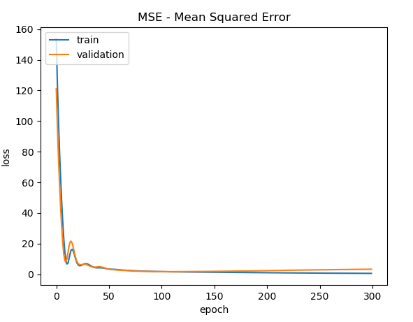
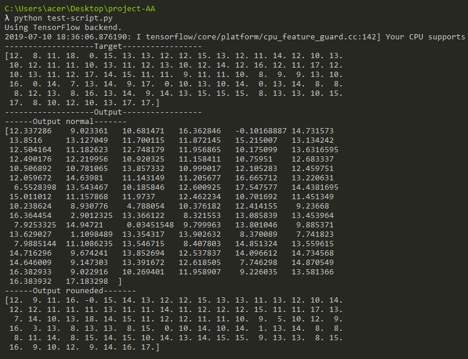
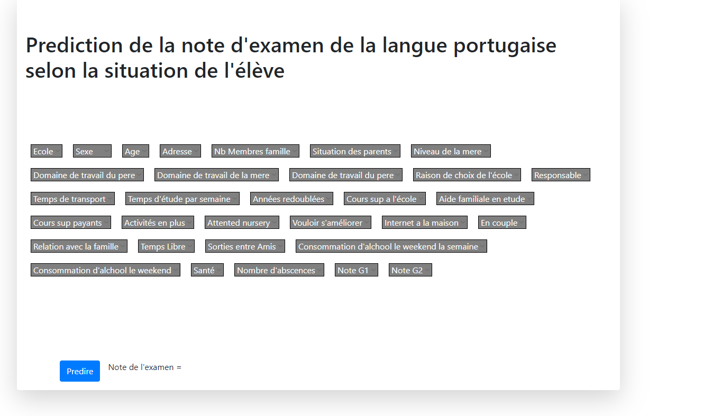

# Project of classification prediction on students notes

## Specifications :

- The project is based on Keras framework to train the model.

- The application is based on Flask/Python to test the model.
- The dataset contains students notes on portugese exams and student's situations.

### Model's Results :

### Predictions :

### Preview of the app : 
